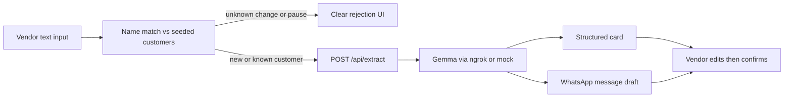

# Dairy Mitra — Full Implementation Plan (Agent Brief)

**Hand this entire document to the coding agent.** Build everything described here end-to-end. Do not invent extra features (no real auth, payments, GPS, WhatsApp API, or voice). Prefer working demo polish over architecture sprawl.

**Assumptions (locked):**

- New repo / empty repo named `dairy-mitra` (only a placeholder MD today). Scaffold from scratch.
- Coding agent builds the **Next.js web app** in this repo, plus a `kaggle/` folder with notebook + prompt stubs and the exact API contract.
- Live inference = Gemma on Kaggle GPU exposed with **FastAPI + ngrok**. App talks to that URL via `GEMMA_API_URL`.
- Local/dev without GPU = **mock extractor** returning deterministic JSON for demo phrases so UI always works.

---

## 1. Product summary

**Dairy Mitra** (“dairy friend”) helps local milk vendors (doodhwala) turn informal Gujarati / Gujlish instructions into:

1. A structured, editable customer/subscription card
2. A Gujarati WhatsApp-ready confirmation message

**Primary user:** the vendor (not the household customer).

**Core pipeline:**




**Demo intents only:** `new_subscription` | `pause` | `quantity_change` | `cancel`  
**Out of scope for code:** monthly billing, UPI, GPS, multi-vendor, inventory, real WhatsApp send, voice, chat history.

---

## 2. Tech stack (exact)


| Layer         | Choice                                                                         |
| ------------- | ------------------------------------------------------------------------------ |
| Framework     | **Next.js 15** (App Router) + TypeScript                                       |
| UI            | **React 19**, **Tailwind CSS v4**, **Framer Motion** (2–3 intentional motions) |
| Fonts         | Google Fonts: **Fraunces** (brand/display) + **Figtree** (UI body)             |
| Icons         | `lucide-react`                                                                 |
| Validation    | `zod`                                                                          |
| HTTP          | native `fetch`                                                                 |
| Data          | hardcoded JSON module (no DB)                                                  |
| Env           | `.env.local` with `GEMMA_API_URL`, `USE_MOCK_GEMMA`                            |
| Deploy target | Vercel-friendly (env-based Gemma URL)                                          |


Create with:

```bash
npx create-next-app@latest . --typescript --tailwind --eslint --app --src-dir --import-alias "@/*" --turbopack --yes
```

Then add: `framer-motion`, `lucide-react`, `zod`.

---

## 3. Repository structure

```
dairy-mitra/
├── README.md
├── .env.example
├── .gitignore
├── package.json
├── next.config.ts
├── tsconfig.json
├── postcss.config.mjs
├── public/
│   └── images/                 # hero dairy atmosphere (real photo assets or high-quality placeholders)
├── src/
│   ├── app/
│   │   ├── layout.tsx
│   │   ├── page.tsx                 # Landing (brand hero)
│   │   ├── globals.css
│   │   ├── workspace/
│   │   │   └── page.tsx             # Main capture + result
│   │   ├── customers/
│   │   │   └── page.tsx             # Seeded customer list
│   │   └── api/
│   │       ├── extract/route.ts     # Proxies to Gemma or mock
│   │       ├── customers/route.ts   # GET seeded customers
│   │       └── health/route.ts      # Checks GEMMA_API_URL /health
│   ├── components/
│   │   ├── layout/
│   │   │   ├── SiteHeader.tsx
│   │   │   └── SiteFooter.tsx
│   │   ├── landing/
│   │   │   └── Hero.tsx
│   │   ├── workspace/
│   │   │   ├── InstructionForm.tsx
│   │   │   ├── ExampleChips.tsx
│   │   │   ├── ResultCard.tsx
│   │   │   ├── WhatsAppDraft.tsx
│   │   │   └── RejectBanner.tsx
│   │   └── customers/
│   │       └── CustomerTable.tsx
│   ├── lib/
│   │   ├── customers.ts             # Seeded data
│   │   ├── matching.ts              # Name match rules
│   │   ├── types.ts                 # Shared types + zod schemas
│   │   ├── gemma-client.ts          # Call remote /extract
│   │   ├── mock-gemma.ts            # Deterministic demo responses
│   │   └── whatsapp-templates.ts    # Fallback templates if model omits message
│   └── styles/ (optional tokens only if not in globals)
└── kaggle/
    ├── README.md                    # How Maulik runs Gemma + ngrok
    ├── dairy_mitra_extract.ipynb    # Stub cells: load model, FastAPI, ngrok
    └── prompts/
        └── extract_system.txt       # Exact system prompt text
```

---

## 4. Design system (beautiful, specific — follow exactly)

**Brand name on every first viewport:** **Dairy Mitra** must read as the hero-level signal (large wordmark), not nav-only text.

**Visual direction (locked — do not drift into purple gradients, cream+#terracotta serif kitsch, or dense broadsheet):**

- Atmosphere: cool morning dairy — milk white, soft sage leaf, deep ink
- CSS variables in `globals.css`:

```css
:root {
  --bg: #f7faf8;
  --bg-elevated: #ffffff;
  --ink: #14201a;
  --muted: #5b6b62;
  --sage: #3f6f5b;
  --sage-deep: #2a4d3f;
  --foam: #e8f0eb;
  --line: #d5e2da;
  --warn: #9a3412;
  --ok: #166534;
  --radius: 1rem;
}
```

- Background: soft vertical gradient `foam → bg` plus a very subtle milk-ripple SVG/noise pattern (not flat single color).
- Landing hero: **full-bleed** dairy atmosphere image (pouring milk / early-morning booth / cans) as edge-to-edge plane behind/beside content — not inset card media.
- Hero budget: brand wordmark, one headline, one short sentence, one CTA group only. No stats strips, no promo chips on media.
- No cards in the hero. Cards are allowed only for interactive results (structured output, WhatsApp draft).
- Motion (Framer Motion): (1) hero wordmark fade/rise on load, (2) result card spring-in after extract, (3) soft hover on primary CTA.
- Typography: Fraunces for “Dairy Mitra” + headlines; Figtree for body/forms.
- Mobile: stack hero text over image; workspace form full-width; sticky submit on small screens.

**Copy tone:** warm, local, clear Gujarati examples in UI chips; English chrome labels (“Instruction”, “Customers”, “Confirm”).

---

## 5. Pages

### 5.1 `/` — Landing

- Full-bleed hero, brand **Dairy Mitra**
- Headline idea: “Your doodhwala’s memory, structured.”
- Sub: one line about turning call notes into cards + WhatsApp drafts
- CTAs: primary **Open workspace** → `/workspace`; secondary **View customers** → `/customers`
- Minimal header: logo text + links Workspace / Customers
- No feature grid, no stats, no secondary marketing blocks in first viewport

### 5.2 `/workspace` — Main product screen

**Layout (one job):** capture instruction → show match/result.

Sections below the fold / same page after submit:

1. **InstructionForm** — large textarea (Gujarati/Gujlish), Submit, Clear
2. **ExampleChips** — clickable demo phrases (pre-fill textarea)
3. On submit:
  - Client POST `/api/extract` with `{ text }`
  - Loading state with calm copy (“Reading the instruction…”)
4. Outcomes:
  - **RejectBanner** if matching layer rejects unknown pause/change
  - **ResultCard** (editable fields by intent)
  - **WhatsAppDraft** (editable textarea + Copy button)
5. Confirm button: client-only success toast/state (“Saved for demo”) — updates in-memory customer list if you keep React state; persistence across refresh not required

### 5.3 `/customers` — Seeded state credibility

- Simple list/table of hardcoded customers (name, product, qty, rate, status)
- One short line of purpose: “These are the active subscriptions Dairy Mitra already knows.”
- Link to workspace

### 5.4 Shared chrome

- `SiteHeader` / `SiteFooter` (footer: one-line “Hackathon prototype · Gemma-powered extraction”)

---

## 6. Hardcoded data & matching rules

### 6.1 Seeded customers (`src/lib/customers.ts`)

```ts
export const CUSTOMERS = [
  {
    id: "c1",
    name: "Bhavinbhai",
    nameAliases: ["bhavinbhai", "bhavin bhai", "ભાવિનભાઈ", "ભાવિન ભાઈ"],
    product: "Buffalo Milk",
    quantityLiters: 2,
    frequency: "daily",
    ratePerLiter: 70,
    billing: "monthly",
    status: "active",
  },
  {
    id: "c2",
    name: "Ramaben",
    nameAliases: ["ramaben", "rama ben", "રમાબેન"],
    product: "Cow Milk",
    quantityLiters: 1,
    frequency: "daily",
    ratePerLiter: 60,
    billing: "monthly",
    status: "active",
  },
  {
    id: "c3",
    name: "Patel Saheb",
    nameAliases: ["patel saheb", "patel", "પટેલ સાહેબ", "પટેલ"],
    product: "Cow Milk",
    quantityLiters: 1,
    frequency: "daily",
    ratePerLiter: 60,
    billing: "monthly",
    status: "active",
  },
] as const;
```

### 6.2 Matching algorithm (`src/lib/matching.ts`)

1. Normalize input: lowercase, strip extra spaces; keep Gujarati as-is for substring checks.
2. Find customer if any `name` / `nameAliases` appears as substring in input (case-insensitive for Latin).
3. Heuristic intent hints (pre-Gemma, for reject path only):
  - pause-like if text matches `/બંધ|pause|skip|bandh|રાખ/i`
  - change-like if `/લીટર|liter|increase|decrease|થી|કર/i` and not clearly “new”
  - new-like if `/ચાલુ|start|new|શરૂ/i`
4. **Rules:**
  - Match found → always call Gemma (or mock).
  - No match + new-like → call Gemma as `new_subscription`.
  - No match + pause/change/cancel-like → **do not call Gemma**; return HTTP 200 with `{ ok: false, code: "UNKNOWN_CUSTOMER", message: "No active subscription found for this name." }`.
  - No match + unclear → call Gemma anyway; if Gemma returns pause/change/cancel without resolvable customer, surface same rejection after parse.

Expose matched customer id (if any) to the client in the API response for UI highlighting.

---

## 7. Types & JSON contract (shared with Gemma)

`src/lib/types.ts` — single source of truth. Kaggle must return this shape.

```ts
export type Intent =
  | "new_subscription"
  | "pause"
  | "quantity_change"
  | "cancel";

export type ExtractSuccess = {
  ok: true;
  intent: Intent;
  confidence: number; // 0..1
  customer: {
    name: string;
    matchedCustomerId: string | null;
  };
  fields: {
    product?: string | null;
    quantityLiters?: number | null;
    oldQuantityLiters?: number | null;
    frequency?: "daily" | "alternate" | "one_time" | null;
    startDate?: string | null;       // ISO date or "today" | "tomorrow"
    effectiveDate?: string | null;
    pauseDates?: string[] | null;
    reason?: string | null;
    ratePerLiter?: number | null;
    billing?: "monthly" | "daily_cash" | null;
    status?: string | null;
  };
  whatsappMessageGu: string; // Gujarati confirmation
  notes?: string | null;
};

export type ExtractFailure = {
  ok: false;
  code: "UNKNOWN_CUSTOMER" | "INVALID_INPUT" | "MODEL_ERROR";
  message: string;
};

export type ExtractResponse = ExtractSuccess | ExtractFailure;
```

**Intent-specific fields expected:**

- `new_subscription`: product, quantityLiters, frequency, startDate, ratePerLiter, billing
- `pause`: pauseDates or effectiveDate, reason optional
- `quantity_change`: oldQuantityLiters optional, quantityLiters (new), effectiveDate
- `cancel`: effectiveDate

---

## 8. APIs

### 8.1 `POST /api/extract`

**Request:** `{ "text": string }`  
**Server steps:**

1. Validate with zod (`text` min 2 chars).
2. Run matching layer.
3. If reject → return `ExtractFailure` UNKNOWN_CUSTOMER.
4. If `USE_MOCK_GEMMA=true` OR `GEMMA_API_URL` empty → `mockExtract(text, matchedCustomer)`.
5. Else `POST ${GEMMA_API_URL}/extract` with body:

```json
{
  "text": "<raw>",
  "matched_customer": { "id": "c2", "name": "Ramaben", "quantityLiters": 1 } | null,
  "known_customers": [ { "id", "name", "quantityLiters" } ]
}
```

1. Validate remote JSON with zod; on failure return MODEL_ERROR.
2. Attach `matchedCustomerId` if missing.
3. Return `ExtractSuccess`.

Timeout: 60s. CORS not needed for same-origin.

### 8.2 `GET /api/customers`

Returns seeded `CUSTOMERS` array.

### 8.3 `GET /api/health`

Returns `{ app: "ok", gemma: "ok"|"skipped"|"down", gemmaUrlSet: boolean }` by pinging `${GEMMA_API_URL}/health` when set and mock disabled.

---

## 9. Mock Gemma (`src/lib/mock-gemma.ts`)

Implement deterministic responses for these exact (and fuzzy) demo strings so the pitch works offline:


| Input (approx)                                                       | Intent                          | Result                 |
| -------------------------------------------------------------------- | ------------------------------- | ---------------------- |
| `ભાવિનભાઈ ને આજથી 2 લીટર ભેંસનું દૂધ ચાલુ કર્યું, મહિને bill આપશે.`  | new_subscription                | Bhavinbhai card + WA   |
| `કાલે રમાબેનને દૂધ બંધ રાખજો, એ ગામડે જાય છે.`                       | pause                           | Ramaben pause tomorrow |
| `પટેલ સાહેબનું 1 લીટરથી 1.5 લીટર કરી નાખો આજથી.`                     | quantity_change                 | Patel 1→1.5            |
| Any pause/change mentioning unknown name e.g. `કાલે સુરેશને દૂધ બંધ` | handled by matching before mock | UNKNOWN_CUSTOMER       |


Also ship English/Gujlish variants of the three happy-path examples in `ExampleChips`.

WhatsApp examples (Gujarati), e.g. pause:

> રમાબેન, તમારું કાલનું દૂધ બંધ રાખવામાં આવશે (ગામડે જવાને કારણે). આભાર — Dairy Mitra

---

## 10. UI component behavior details

**InstructionForm**

- Textarea placeholder with one Gujlish example
- Disabled submit while loading
- Show character count optional (skip if clutter)

**ResultCard**

- Intent badge (New / Pause / Quantity / Cancel) with sage styling
- Editable inputs for relevant fields only
- Show linked customer name + “updating existing” vs “new customer”

**WhatsAppDraft**

- Monospace-ish comfortable text area
- Copy to clipboard button with “Copied” feedback
- Label: “WhatsApp-ready (edit before sending)”

**RejectBanner**

- Clear ink/warn styling, not a tiny toast — visible explanation

**ExampleChips**

- 3 happy-path + 1 unknown-customer chip for the rejection demo beat

---

## 11. Env & config

`.env.example`:

```
USE_MOCK_GEMMA=true
GEMMA_API_URL=
# Example when live: https://xxxx.ngrok-free.app
```

`.env.local` for local UI: `USE_MOCK_GEMMA=true`.  
For live demo with Maulik’s tunnel: `USE_MOCK_GEMMA=false` and `GEMMA_API_URL=https://...` (env var only — never hardcode ngrok URL in source).

---

## 12. Kaggle side (contract for Maulik — include stubs in repo)

`kaggle/README.md` must document:

1. Enable GPU (T4) in Kaggle.
2. Load Gemma (hackathon-specified Gemma 4 / available Gemma instruct weights via HF or Kaggle Models).
3. FastAPI app with:
  - `GET /health` → `{ "status": "ok" }`
  - `POST /extract` → accepts body from §8.1, runs prompt from `prompts/extract_system.txt`, returns `ExtractSuccess` JSON only (no markdown fences).
4. `pyngrok` + auth token → print public URL → put into Next `.env.local` as `GEMMA_API_URL`.
5. CORS: allow all origins for hackathon demo.
6. Keep notebook cell running during judging; URL may change on restart — update env.

**System prompt requirements** (`extract_system.txt`):

- You are Dairy Mitra extractor for Gujarati/Gujlish dairy vendor notes.
- Output **only** valid JSON matching `ExtractSuccess` fields (without wrapping `ok` if easier — then notebook wraps `ok: true`).
- One intent per message; refuse multi-intent.
- Prefer `matched_customer` when provided.
- Always produce `whatsappMessageGu` polite short Gujarati.
- Dates: normalize to `today` / `tomorrow` / `YYYY-MM-DD`.

Notebook stub cells are enough for the web agent; Maulik fills model-loading details.

---

## 13. Implementation order (agent checklist)

1. Scaffold Next.js + deps + fonts + CSS variables + layout chrome.
2. Add `types.ts`, `customers.ts`, `matching.ts`, zod schemas.
3. Implement `mock-gemma.ts` + `/api/extract` + `/api/customers` + `/api/health`.
4. Build `/customers` page.
5. Build `/workspace` form + chips + loading + reject + result + WhatsApp copy.
6. Build landing `/` hero (brand-first, full-bleed, motion).
7. Wire `gemma-client.ts` for live mode; verify with mock first (`USE_MOCK_GEMMA=true`).
8. Add `kaggle/` stubs + `.env.example` + README (setup, demo script, env).
9. Manual QA of the 4 demo chips end-to-end.
10. `npm run build` must succeed with zero type errors.

---

## 14. Demo script (README section)

1. Open Customers — show Ramaben / Bhavinbhai / Patel Saheb exist.
2. Workspace → chip **new subscription** → structured card + WA message.
3. Chip **pause Ramaben** → different card behavior (proves context).
4. Chip **unknown name pause** → rejection (“No active subscription…”).
5. Say aloud: monthly billing / UPI / GPS are natural next steps — not built.
6. If tunnel live: flip `USE_MOCK_GEMMA=false`, re-run one chip against Gemma.

---

## 15. README requirements

Include: project one-liner, screenshots placeholder, setup (`npm i`, `npm run dev`), env vars, mock vs live Gemma, demo phrases, out-of-scope list, folder map.

---

## 16. Explicit non-goals (agent must not build)

- NextAuth / login screens / roles
- Prisma/Postgres/Mongo
- WhatsApp Business API send
- Voice upload / Whisper
- Multi-turn chatbot UI
- Payment / UPI
- Maps / GPS / route optimization
- Monthly bill generator UI
- Admin analytics dashboard

---

## 17. Definition of done

- `npm run dev` shows beautiful landing + working workspace in mock mode
- All 4 demo chips behave correctly
- Live mode documented and code-complete (`GEMMA_API_URL` + `/extract` proxy)
- Types shared; zod validates API I/O
- Production `npm run build` passes
- Teammate can pitch without touching Kaggle if mock stays on

